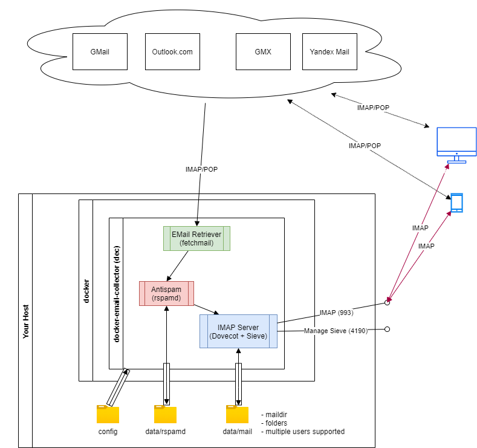

# Docker Email Collector

## Features

1. All your emails can be collected from multiple mailboxes via IMAP/POP3 by [fetchmail](https://www.fetchmail.info/)
2. All fetched emails will be passed to the learning spam filter [rspamd](https://www.rspamd.com/) for spam recognition
3. After spam filter, the emails will be delivered to [dovecot](https://www.dovecot.org/) and stored on your server in the [maildir](https://en.wikipedia.org/wiki/Maildir) format
4. Additionally, you can define server-side [sieve scripts](http://sieve.info/) that allow you automatically classify your emails in different folders
5. Finally, you can access all your emails, that are already spam-filtered and organized in folders, from various devices on the same time via IMAP (e.g. Outlook, Thunderbird, Android or iOS mail clients, or install some web mailer).

## Data flow diagram

## Which problems can be solved by docker-email-collector?

1. If your web mail providers store your emails, the NSA, government or mail provider employees could simplier read your emails. What if some successful hacker could entry your email account? 
Docker-email-collector collects all your emails and store them to your mailbox on the server controlled by you and improve your privacy, because the storage time at your mail provider is very short (this can be solved with normal email client software too, but the client must be online 24/7)

2. You have multiple email addresses (more than 2) at different email providers, but you want to read your emails in one mailbox (this can be solved with normal email client software like outlook or thunderbird too)

3. You check your emails from different devices, but if you delete or move an email to a folder that must occur for all devices (this can be solved with IMAP too)

4. You need filter rules that work for all your accounts, not for each of them

5. You are free to backup or move your emails from server to server or change your email addresses and email providers without hard binding

Each of these problems can be solved separated from the other, but

**Docker-email-collector solves all the listed problems at the same time!**

## Which problems can NOT be solved by docker-email-collector?

1. There is no Mail Transfer Agent (MTA) like Postfix or Exim inside of DEC, so you cannot receive or send your emails over the network via SMTP. For sending emails you will need to use your original mail providers.
At the same time, the missing MTA reduce the complexity of DEC.  
If you need your own MTA - use [mailu](https://mailu.io/) or [docker-mailserver](https://github.com/docker-mailserver/docker-mailserver)

## Installation
### Requirements
Docker and docker-compose (or docker-swarm) installed on your host

### First step: start with docker-compose
Use one of the examples in [doc/docker-compose-examples](./doc/docker-compose-examples/) and adjust the files so your settings are matched.

1. Replace passwd:ro with passwd:rw - this will help you create new users
2. Create TLS/SSL certificates that should be used for connection encryption: you can create your own self-signed certificates, use certbot for letsenrypt or buy the certificates. The used example uses the certificates provided by letsencrypt
3. Create a `data` folder in your host system and give that folder 0777 permissions, because it will be used later for automatical creation of the needed folders `data/mail` (storage for user emails and sieve scripts) and `data/rspamd` (storage for learning spam data of rspamd).
4. `config/dovecot/passwd` shows you how to define users for IMAP access
5. Files in `config/fetchmail/jobs` show you how to define jobs for fetchmail to retrieve emails form various email providers. Good documentation for the syntax you can find [here](https://www.linode.com/docs/guides/using-fetchmail-to-retrieve-email/)
6. Start the container with `docker-compose up -d` from the folder where your `docker-compose.yml` is placed
7. Check with `docker-compose ps` whether IMAP (4993) and Manage-Sieve (4190) are bound and `State` is `Up` for container `dec`

*P.S. use for IMAP other port than standard port 993 (better between 40000 and 60000) to reduce attempts for automatical brute forcing your IMAP*

### Second step: check your IMAP and Sieve connection

1. Connect to the newly started dovecot from some IMAP client, e.g. [Mozilla Thunderbird](https://www.thunderbird.net/) with these settings with IP address of your server and port 4993 (username=test1 password=test)
2. If this works, you can see the IMAP Mailbox and create new IMAP folders
3. In Thunderbird install the add-on `sieve` and try to connect to your server via the manage-sieve protocol

### Third step: create your user

1. In the terminal on your host naigate to the folder with `docker-compose.yml` and execute `docker exec -it dec /dec/dovecot/adduser.sh {USER} {PASSWORD}` (replace {USER} and {PASSWORD} by your new user and password)
2. Open the file `config/dovecot/passwd` in the text editor like e.g. `nano` and control that your new user {USER} has been added to the end of the file. Additionally, now you can remove all lines with test1 and test2 users because they are not needed anymore

### Fourth step: new user's IMAP and fetchmail

1. Shutdown the container with `docker-compose down`
2. Replace passwd:rw with passwd:ro in the `docker-compose.yml`
3. Create some profiles in `config/fetchmail/jobs/, use the [description for fetchmail syntax](https://www.linode.com/docs/guides/using-fetchmail-to-retrieve-email/). At this step always use options `fetchall`,`fetchlimit` and `keep`, because we want to test whether it works in this step
4. Change `FETCHMAIL_ENABLED: 0` to `FETCHMAIL_ENABLED: 1` in `docker-compose.yml`
5. Start the container with `docker-compose up -d` from the folder where your `docker-compose.yml` is placed
6. Change the thunderbird settings for the `test`-Account to {USER} and {PASSWORD} defined by you in Step 3.1
7. Check the inbox - that should now list some emails, fetched by fetchmail

Repeat this step for different other accounts and create new files in `config/fetchmail/jobs/`. If you test some account you can deactivate other jobs by replacing `poll` with `skip`

### Fifth step: everything works

1. After all tests, shutdown the container with `docker-compose down`
2. Replace all `skip` commands with `poll` in all must-be-running `config/fetchmail/jobs/`
3. Use # to uncomment all `fetchall` and `keep` commands in all `config/fetchmail/jobs/`
4. Start the container with `docker-compose up -d`
5. Now, it takes some time to collect all your emails from all your mail providers

